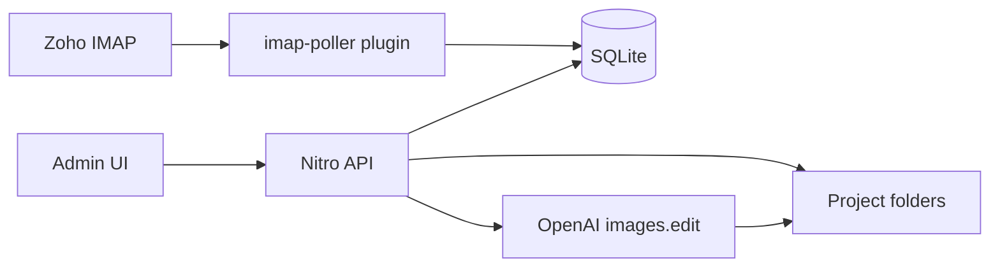

# Architecture

Storytime is a local-first Nuxt full-stack app. The browser UI talks to Nitro API routes on the same server. All data stays on the user's Mac.

## Components

| Layer | Location | Role |
|-------|----------|------|
| UI | `app/pages/`, `app/components/` | Admin panel (Inbox, Projects, Media, Settings) |
| API | `server/api/` | HTTP endpoints |
| Services | `server/utils/` | Business logic (IMAP, OpenAI images, PDF, media library) |
| Plugins | `server/plugins/` | DB init, IMAP poller |
| Storage | `data/` | SQLite DB, project folders, site media, fonts, logs |

## Data flow

## SQLite vs markdown

- **SQLite** (`data/storytime.db`) indexes emails, projects, and processing jobs. It is the source of truth for project status and image order.
- **`project.md`** in each project folder stores human-readable notes only.
- Notes are written to `project.md` when updated; structured fields go to SQLite only. On startup, `reconcileProjectsFromDisk()` imports folders missing from SQLite (migrating legacy frontmatter if present).

## Email processing

1. Poller syncs inbox metadata into `emails` table (by `Message-ID`, idempotent).
2. Admin selects emails and clicks **Process** (download + Sharp preprocess only).
3. API validates single sender + image attachments.
4. Attachments downloaded via IMAP → `original/`.
5. [`imagePreprocessor.ts`](server/utils/imagePreprocessor.ts) preprocesses each image → `preprocessed/*.png` (portrait, brighten, white background).
6. Admin reviews preprocessed images and selects which need AI worksheet cleanup.
7. **Finalize**: unselected images copy `preprocessed/` → `processed/`; selected images run OpenAI `images.edit` via [`imageProcessor.ts`](server/utils/imageProcessor.ts).
8. Thumbnails generated → `thumbnails/`.
9. Emails marked processed; project row updated.

Projects with a pending review job cannot accept new Process runs until finalize completes.

## Error reporting

- API returns `{ error: { code, message, details? } }`
- User sees Nuxt UI toasts
- Server writes structured JSON lines to `data/logs/app.log`
- Inbox shows per-email `status_message`
- Header shows last sync time / failure banner

## Phase 2 hooks

- Manuscript editor + `manuscript.json` / `manuscript.original.json` drive PDF export and reset
- Site-wide media library under `data/media/` for reuse across projects
- `processing_jobs` table supports async processing if OpenAI calls get slow
- Customize prompt/model via settings UI or `OPENAI_IMAGE_*` env vars
- Default manuscript font via settings (`Literata`)
