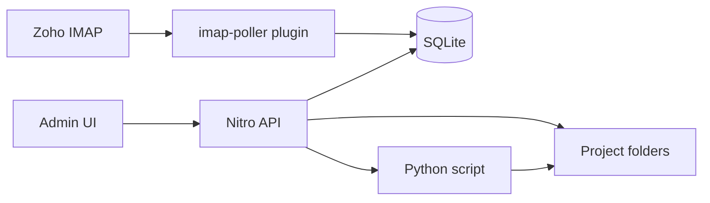

# Architecture

Storytime is a local-first Nuxt full-stack app. The browser UI talks to Nitro API routes on the same server. All data stays on the user's Mac.

## Components

| Layer | Location | Role |
|-------|----------|------|
| UI | `app/pages/`, `app/components/` | Admin panel (Inbox, Projects) |
| API | `server/api/` | HTTP endpoints |
| Services | `server/utils/` | Business logic (IMAP, processing, PDF) |
| Plugins | `server/plugins/` | DB init, IMAP poller |
| Storage | `data/` | SQLite DB, project folders, logs |

## Data flow

## SQLite vs markdown

- **SQLite** (`data/storytime.db`) indexes emails, projects, and processing jobs for fast list views.
- **`project.md`** in each project folder stores human-readable notes and frontmatter (status, image order).
- On every project update, both are written. On startup, `reconcileProjectsFromDisk()` imports folders missing from SQLite.

## Email processing

1. Poller syncs inbox metadata into `emails` table (by `Message-ID`, idempotent).
2. Admin selects emails and clicks Process.
3. API validates single sender + image attachments.
4. Attachments downloaded via IMAP → `original/`.
5. Python script runs → `processed/`.
6. Thumbnails generated → `thumbnails/`.
7. Emails marked processed; project row updated.

## Error reporting

- API returns `{ error: { code, message, details? } }`
- User sees Nuxt UI toasts
- Server writes structured JSON lines to `data/logs/app.log`
- Inbox shows per-email `status_message`
- Header shows last sync time / failure banner

## Phase 2 hooks

- Swap `PYTHON_SCRIPT_PATH` for the real image pipeline
- Replace `pdfGenerator.ts` implementation without changing the UI
- `processing_jobs` table supports async processing if Python gets slow
